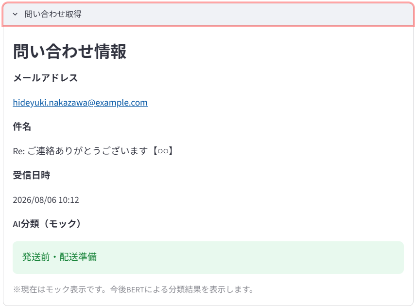

# 画面設計

## Figma

Figmaで作成したモックアップを参照

[figmaモックアップを開く](https://www.figma.com/design/02c59EdmcqAfApph9iUk59/%E9%85%8D%E9%80%81%E6%A5%AD%E5%8B%99%E6%94%AF%E6%8F%B4%E3%82%A2%E3%83%97%E3%83%AA_?node-id=0-1&p=f&t=JefUP5tGEJ8hyeUS-0)

## Streamlit

### 1. 初期画面
発送業務の各工程を一覧表示する。

### 2. 問い合わせ取得 

### 3. 発送前・配送準備
BERTの分類結果に応じて必要な作業項目を表示する。

### 4. 発送前・梱包

### 5. 倉庫会社から発送・リレーション連絡

### 6. 倉庫会社から発送・スマレジ登録

